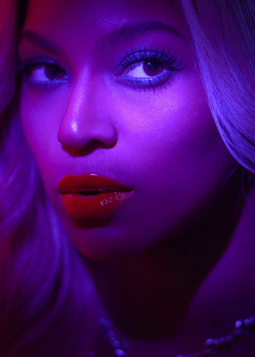
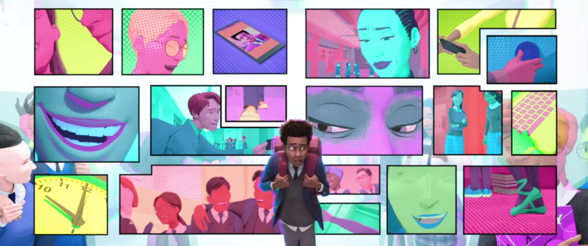
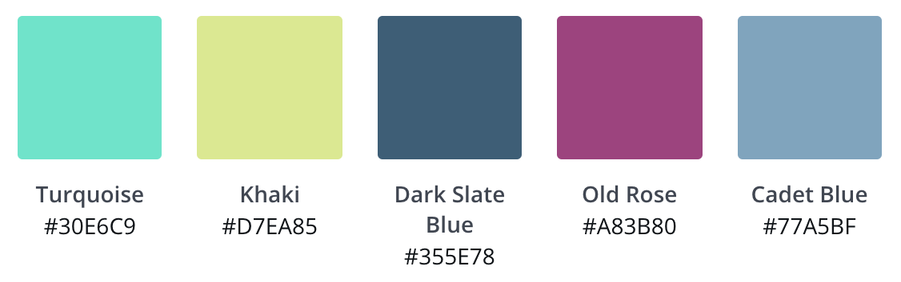

```{r setup, include=FALSE}
options(htmltools.dir.version = FALSE)

list.of.packages <- c("ggplot2", "yarrr", "tidyverse", "RColorBrewer", 
                      "viridis", "hexbin", "devtools", "ghibli", "wesanderson",
                      "harrypotter", "ggsci", "gridExtra", "backports")
new.packages <- list.of.packages[!(list.of.packages %in% installed.packages()[,"Package"])]
if(length(new.packages)) install.packages(new.packages, repos = "http://cran.us.r-project.org")

rm("list.of.packages", "new.packages")

library(tidyverse)

knitr::opts_chunk$set(fig.dim=c(4.0, 4.0), fig.retina=2, out.width="98%")

```

[🎶 The Pussycat Dolls - Don't Cha ft. Busta Rhymes](https://www.youtube.com/watch?v=YNSxNsr4wmA)

Image credit: [Giphy](https://giphy.com/gifs/nicole-scherzinger-pussycat-dolls-pcd-zHWESnDS3rJXG)

```{r, echo=FALSE, out.width = 700, fig.align='center'}

knitr::include_graphics("https://media.giphy.com/media/zHWESnDS3rJXG/giphy.gif")

```

---
# Colour matters!

```{r, echo=FALSE, out.width = 700, fig.align='center'}

knitr::include_graphics("images/color-pencils-colored-pencils-colorful-50996.jpg")

```

---
class: inverse, center, middle

# Why?

---

# Colours can:

--

- .large[influence emotion, which can influence how people understand your data.]

--

- .large[connect to meaning. (Hot and cold? .red[**Red**] and .blue[**blue**].)]

--

- .large[show **more** or .gray[**less**] with intensity/brightness.]

--
<br></br>

Good discussion in this [interview with Maureen Stone,](https://www.fastcompany.com/3062182/how-to-use-color-to-prove-your-point-from-a-data-viz-expert) a colour expert with Tableau.


---

# What's this talk for?

--

- .large[tips about what to think about when *picking* palettes]

--

- .large[showing some cool/useful palettes]

--

# Assumptions I'm making

--

- .large[you are somewhat familiar with `ggplot` and R in general]

--

- .large[you don't need heaps of technical info on hex codes and colour theory for this to be fun and useful]

---
# How do you tell computers about colours?

--
.large[You'll usually see a colour written in one of 4 ways:
- Just as a **colour name**, like "red". Has to be one R recognises - [list here](http://www.stat.columbia.edu/~tzheng/files/Rcolor.pdf)

- As a mix of **hue, saturation and lightness** (HSL)

- As a mix of **redness, greenness and blueness** (RGB)

- As 6 numbers/letters with a # at the front eg. #ff0000 (**Hex code**)]

[Useful colour tool](https://www.w3schools.com/colors/colors_picker.asp)

[Chrome extension for picking colours from webpages](https://chrome.google.com/webstore/detail/colorzilla/bhlhnicpbhignbdhedgjhgdocnmhomnp/related?hl=en)

---
class: inverse, middle, center

# What do you need your colours to do?

---
class: middle, center

.large[Just look different from each other?]

--

.large[You want a **qualitative palette**.]

---
.left-code[
## Qualitative palette use case
```{r, bars, fig.show="hide"}
# Use the iris dataset
data("iris")

# Create a simple barchart
# of mean petal width
bars <- iris %>% 
  group_by(Species) %>% 
  summarise(meanPW = mean(Petal.Width)) %>% 
  ggplot(aes(x = Species, 
             y = meanPW, 
             fill = Species)) +
  geom_bar(stat = "identity") +
  theme_minimal() +
  guides(fill = FALSE)

bars

```
]

.right-plot[
`)
]


---
class: middle, center

.large[Show a range from more to less?]

--

.large[You want a **sequential palette**.]

---
.left-code[
## Sequential palette use case
```{r, petals, fig.show="hide"}
# Use the iris dataset
data("iris")

# Make a scatterplot
# points coloured by petal length
petals <- iris %>% 
  ggplot(aes(x = Sepal.Length, 
             y = Sepal.Width,
             color = Petal.Length)) +
  geom_point() +
  theme_minimal() +
  theme(legend.position="bottom")

petals
```
]

.right-plot[
`)
]


---
class: middle, center

.large[Contrast around a specific point?]

--

.large[You want a **diverging palette**.]

<br>
<br>
<br>
.small[Thanks to [this Everyday analytics article](https://everydayanalytics.ca/2017/03/when-to-use-sequential-and-diverging-palettes.html) for helping my clarify my thinking on this one.]

---
## Diverging palette use case
```{r, echo=FALSE, out.width= 650, out.height = 450, fig.align='center'}

knitr::include_graphics("images/mf_occup.png")

```


[Source: Nathan Yau, Flowing Data]("https://flowingdata.com/2017/09/11/most-female-and-male-occupations-since-1950/")

---
class: inverse, center, middle

# Palette time!

---
.left-code[
# Viridis
<a href="https://cran.r-project.org/web/packages/viridis/vignettes/intro-to-viridis.html" target="_blank"><button class="button">📦 `Viridis`</button></a> 

Perceptually uniform! 
Gorgeous for continuous data.

```{r, viridis1, fig.show="hide", message=FALSE}
library(viridis)
library(hexbin)

ggplot(data.frame(x = rnorm(10000), 
                  y = rnorm(10000)), 
       aes(x = x, y = y)) +
  geom_hex() + 
  coord_fixed() + 
  scale_fill_viridis() + 
  theme_bw()
```
]

.right-plot[
`)
]

---
# Viridis
<a href="https://cran.r-project.org/web/packages/viridis/vignettes/intro-to-viridis.html" target="_blank"><button class="button">📦 `Viridis`</button></a> 

```{r, echo = FALSE, out.height=450}
knitr::include_graphics("images/viridis.png")
```

---
.left-code[
# Viridis
<a href="https://cran.r-project.org/web/packages/viridis/vignettes/intro-to-viridis.html" target="_blank"><button class="button">📦 `Viridis`</button></a> 

```{r, petalviridis, fig.show="hide"}
petals +
  scale_color_viridis()

```
]

.right-plot[
`)
]

---
.left-code[
# Color Brewer
<a href="https://cran.r-project.org/web/packages/RColorBrewer/index.html" target="_blank"><button class="button">📦 `RColorBrewer`</button></a>
```{r, colorbrewer, fig.show = "hide"}
# Display all the palettes
library(RColorBrewer)
par(mar=c(0,4,0,2))
display.brewer.all()

# Notice
# - sequential
# - qualitative
# - diverging

```
]

.right-plot[
`)
]

---
.left-code[
# Pirate palette

<a href="https://cran.r-project.org/web/packages/yarrr/vignettes/piratepal.html" target="_blank"><button class="button">📦 `yarrr`</button></a>

```{r, pirate1, fig.show="hide", out.height=500}
yarrr::piratepal(palette = "all")
```
]

.right-plot[
`)
]

---
.left-code[
# Pirate palette

<a href="https://cran.r-project.org/web/packages/yarrr/vignettes/piratepal.html" target="_blank"><button class="button">📦 `yarrr`</button></a>

```{r, southpark, fig.show="hide"}
yarrr::piratepal(
          palette = "southpark", 
          trans = .5,
          plot.result = T)
```
[Pirate pal vignette](https://cran.r-project.org/web/packages/yarrr/vignettes/piratepal.html)

]

.right-plot[
`)
]

---
# ochRe
<a href="https://ropensci.org/blog/2017/11/21/ochre/" target="_blank"><button class="button">📦 `ochRe  `</button></a> 🎩 Di Cook [@visnut](https://twitter.com/visnut)

```{r, ochre, out.width=600, echo = FALSE, fig.align='center'}

knitr::include_graphics("images/twinghosts_albertnamatjira.jpg")
```

---
.left-code[
# ochRe
<a href="https://ropensci.org/blog/2017/11/21/ochre/" target="_blank"><button class="button">📦 `ochRe  `</button></a> 🎩 Di Cook [@visnut](https://twitter.com/visnut)

```{r, ochre2, fig.show = "hide", message=FALSE}
# devtools::install_github("ropenscilabs/ochRe")
library(ochRe)

pal_names <- names(ochre_palettes)

par(mfrow=c(length(ochre_palettes)/2, 2), 
    lheight = 2, mar=rep(1, 4), adj = 0)
for (i in 1:length(ochre_palettes)){
    viz_palette(ochre_palettes[[i]], 
                pal_names[i])
}

```

]

.right-plot[
`)
]

---
.left-code[
# Dutchmasters
<a href="https://edwinth.github.io/blog/dutch-masters/" target="_blank"><button class="button">📦 `dutchmasters`</button></a>
<br>
<br>
<br>
<br>
<br>
<br>
<br>
<br>
<br>
<br>
<br>
<br>
<br>
<br>
By <a href="https://en.wikipedia.org/wiki/en:Johannes_Vermeer" class="extiw" title="w:en:Johannes Vermeer">Johannes Vermeer</a> - Copied from Mauritshuis website, resampled and uploaded by <a href="//commons.wikimedia.org/wiki/User:Crisco_1492" title="User:Crisco 1492">Crisco 1492</a> (<a href="//commons.wikimedia.org/wiki/User_talk:Crisco_1492" title="User talk:Crisco 1492">talk</a><span style="white-space:nowrap">&nbsp;·</span> <a href="//commons.wikimedia.org/wiki/Special:Contributions/Crisco_1492" title="Special:Contributions/Crisco 1492">contribs</a>), <span style="white-space:nowrap">October 2014</span>, Public Domain, <a href="https://commons.wikimedia.org/w/index.php?curid=36351343">Link</a>
]

.right-plot[

```{r, fig.align='center', echo=FALSE}

knitr::include_graphics("images/Meisje_met_de_parel.jpg")

```
]

---
.left-code[
# Dutchmasters
<a href="https://edwinth.github.io/blog/dutch-masters/" target="_blank"><button class="button">📦 `dutchmasters  `</button></a>
```{r, dutchmasters, fig.show="hide", message=FALSE}
# devtools::install_github("EdwinTh/dutchmasters")

library(dutchmasters)

pal_names <- names(dutchmasters)

par(mfrow=c(length(dutchmasters)/2, 2), 
    lheight = 2, mar=rep(1, 4), adj = 0)
for (i in 1:length(dutchmasters)){
    viz_palette(dutchmasters[[i]], pal_names[i])
}

```
]

.right-plot[
`)
]

---
# Beyonce
<a href="https://github.com/dill/beyonce" target="_blank"><button class="button">📦 `beyonce  `</button></a>  `r emo::ji("crown")` `r emo::ji("bee")`

```{r, message=FALSE}
#install.packages("devtools") 
#devtools::install_github("dill/beyonce")
#library(tidyverse)
library(beyonce)
```

.pull-left[
```{r, fig.align='center', echo=FALSE, out.width=200}



```
]

.pull-right[
```{r out.height=350, echo=FALSE}
data = tibble(Section = c("L0101", "L0201", "L0301"), 
              `Response rate` = c(0.19, 0.165, 0.118))

bey <- data %>% 
  ggplot(aes(x = Section, y = `Response rate`, 
             fill=Section, label = scales::percent(`Response rate`, accuracy=1))) +
  geom_bar(stat = "identity") +
  scale_y_continuous(limits=c(0,0.20), labels=scales::percent) +
  theme_minimal() +
  geom_text(vjust = -0.5, size = 3) +
  scale_fill_manual(values=c(beyonce_palette(120)[2], 
                             beyonce_palette(120)[8], 
                             beyonce_palette(120)[10]))
bey  
```
]

---
# Beyonce cont.
There are lots of other colour palettes, all adapted from https://beyoncepalettes.tumblr.com/.

```{r, fig.height=3.5}
par(mfrow=c(13,10))
for(i in 1:50) print(beyonce_palette(i)) # just the first 50
```

---
# Ghibli
<a href="https://github.com/ewenme/ghibli" target="_blank"><button class="button">📦 `ghibli  `</button></a> 🎩 Jacquie Tran [@jacquietran](https://twitter.com/jacquietran)

```{r, fig.align='center', echo=FALSE, out.width=600}

knitr::include_graphics("images/ghibli.png")

```

---
.left-code[
# Ghibli
<a href="https://github.com/ewenme/ghibli" target="_blank"><button class="button">📦 `ghibli  `</button></a> 🎩 Jacquie Tran [@jacquietran](https://twitter.com/jacquietran)

```{r, ghibli, fig.show="hide"}
library(ghibli)

# Display palettes with names
par(mfrow=c(9,3))
for(i in names(ghibli_palettes)) {
  print(ghibli_palette(i))
}

```
]

.right-plot[
`)
]

---
.left-code[
# Wes Anderson
<a href="https://github.com/karthik/wesanderson" target="_blank"><button class="button">📦 `wesanderson`</button></a> 
```{r, wesanderson, fig.show= "hide"}
library(wesanderson)

# Display palettes with names
par(mfrow=c(10,2))
for(i in names(wes_palettes)) {
  print(wes_palette(i))
}

```
]

.right-plot[
`)
]

---
.left-code[
# Harry Potter
<a href="https://github.com/aljrico/harrypotter" target="_blank"><button class="button">📦 `harrypotter`</button></a> 🎩 Anna Fergusson [@annafergusson](https://twitter.com/annafergusson)
```{r, luna, fig.show= "hide"}
library(harrypotter)

ggplot(data.frame(x = rnorm(1e4), 
                  y = rnorm(1e4)), 
       aes(x = x, y = y)) +
  geom_hex() + 
	coord_fixed() +
  scale_fill_hp(house = "LunaLovegood") + 
	theme_bw()

```
]

.right-plot[
`)
]

---
# Harry Potter
<a href="https://github.com/aljrico/harrypotter" target="_blank"><button class="button">📦 `harrypotter`</button></a> 🎩 Anna Fergusson [@annafergusson](https://twitter.com/annafergusson)

```{r, echo=FALSE, fig.align='center', out.width=600}

knitr::include_graphics("images/luna_lovegood.png")

```

---
.left-code[
# ggsci
<a href="https://cran.r-project.org/web/packages/ggsci/vignettes/ggsci.html" target="_blank"><button class="button">📦 `ggsci`</button></a>  
A mixture of academic journal palettes and pop culture references.

```{r, ggsci, fig.show= "hide"}
library(ggsci)

ggplot(subset(diamonds, carat >= 2.2),
       aes(x = table, y = price, colour = cut)) +
  geom_point(alpha = 0.7) +
  geom_smooth(method = "loess", 
              alpha = 0.05, size = 1, span = 1) +
  theme_dark() + theme(
    panel.background = 
      element_rect(fill = "#2D2D2D"),
    legend.key = 
      element_rect(fill = "#2D2D2D")) +
  scale_fill_tron()

```
]

.right-plot[
`)
]

---
class: inverse; middle

# What about making your own palette?

---
# Setting up your own palette: Pick your colours

I love this screenshot from *Into the Spiderverse* and used [this free palette generator](https://www.canva.com/colors/color-palette-generator/) to lazily pull colours from it.

```{r itsv, echo=FALSE, fig.align='center', out.width=600}

```

```{r itsvcolours, echo=FALSE, fig.align='center', out.width=500}

```

---
# Setting up your own palette: Load your colours

For a more complete discussion see [this great article](https://drsimonj.svbtle.com/creating-corporate-colour-palettes-for-ggplot2) by Dr Simon Jackson [@drsimonj](https://twitter.com/drsimonj).

.pull-left[

```{r personal, eval=FALSE}
# Set up the colours you want
my_colours <- c(
  `turquoise`  = "#30E6C9",
  `khaki`      = "#D7EA85",
  `slate`      = "#355E78",
  `old-rose`   = "#A83B80",
  `cadet-blue` = "#77A5BF",
  `light grey` = "#cccccc", # added extra neutrals
  `dark grey`  = "#8c8c8c")

#Function that converts names to hexcodes
get_spiderverse_col <- function(...) {
  cols <- c(...)

  if (is.null(cols)) return (my_colours)

  my_colours[cols]
}

# You could just use this function:
ggplot(mtcars, aes(hp, mpg)) +
    geom_point(color = get_spiderverse_col("old-rose"),
               size = 4, alpha = .8) +
  theme_minimal()
```
]
.pull-right[
```{r personal-out, ref.label="personal", echo=FALSE, fig.height=4}
```
]

---
# Setting up your own palette: Group colours into palettes

```{r}
spiderverse_palettes <- list(
  `main`  = get_spiderverse_col("turquoise", "khaki", "old-rose"),

  `blues`  = get_spiderverse_col("cadet-blue", "slate"),

  `full` = get_spiderverse_col("turquoise", "khaki", "slate", "old-rose", "cadet-blue"),

  `neutral`  = get_spiderverse_col("slate", "light grey", "cadet-blue", "dark grey")
)

# Helpful function for retrieving the palettes you just names
spiderverse_pal <- function(palette = "main", reverse = FALSE, ...) {
  pal <- spiderverse_palettes[[palette]]
  if (reverse) pal <- rev(pal)
  colorRampPalette(pal, ...)
}
```

---
# Setting up your own palette: Set up scales for ggplot

```{r}
# Colour scale - good for scatter plots
scale_color_spiderverse <- function(palette = "main", discrete = TRUE, reverse = FALSE, ...) {
  pal <- spiderverse_pal(palette = palette, reverse = reverse)

  if (discrete) {
    discrete_scale("colour", paste0("spiderverse_", palette), palette = pal, ...)
  } else {
    scale_color_gradientn(colours = pal(256), ...)
  }
}

# Fill scale - good for barplots
scale_fill_spiderverse <- function(palette = "main", discrete = TRUE, reverse = FALSE, ...) {
  pal <- spiderverse_pal(palette = palette, reverse = reverse)

  if (discrete) {
    discrete_scale("fill", paste0("spiderverse_", palette), palette = pal, ...)
  } else {
    scale_fill_gradientn(colours = pal(256), ...)
  }
}
```

---
# How did we do?

.pull-left[

```{r, out.height = 370}
ggplot(iris, aes(Sepal.Width, Sepal.Length, color = Species)) +
    geom_point(size = 4) +
    scale_color_spiderverse() +
    theme_minimal()
```
]

.pull-right[
```{r, message=FALSE, out.height=400}

bey +
    scale_fill_spiderverse("neutral") +
    theme_minimal()
```
]

---
# Accessibility resources

- [How to design for colour blindness](https://usabilla.com/blog/how-to-design-for-color-blindness/) with a great link to a [colour blindness simulator](http://www.color-blindness.com/coblis-color-blindness-simulator/)

- <a href="https://cran.r-project.org/web/packages/dichromat/dichromat.pdf" target="_blank"><button class="button">📦 `dichromat`</button></a> - Collapse red-green or green-blue distinctions to simulate the effects of different types of color-blindness.

---
# Other resources and lists of resources

- [Paletti, make your own palettes - from the guy behind the Dutchmasters palette](https://edwinth.github.io/blog/paletti/)

- [Good compilation of resources here](https://blog.prototypr.io/another-post-about-colours-for-data-visualisation-part-3-diy-palettes-bfc8c8bad72f)

- [Datawrapper blog with resources too](https://blog.datawrapper.de/colorguide/), including Art Palette Experiment by Google, Movies

- <a href="http://colorspace.r-forge.r-project.org/articles/hcl_palettes.html" target="_blank"><button class="button">📦 `colorspace`</button></a> - The Colour Space package has lots of great information and palette options.

- [Greyscale functionality in ggplot is pretty good](https://ggplot2.tidyverse.org/reference/scale_grey.html)

- [Datanovia list of R palettes to know](https://www.datanovia.com/en/blog/top-r-color-palettes-to-know-for-great-data-visualization/)

- [This Color Palette Generator by Steven DeGraeve can help make colour palette from an image](https://www.degraeve.com/color-palette/)
 
- Things to think about - which colours do you put next to each other? [Visual blurring is not good](https://datahero.com/blog/2013/08/08/why-color-matters-in-data-visualisation/)

---

class: center, middle

# Thanks!

Slides created via the R package [**xaringan**](https://github.com/yihui/xaringan).

The chakra comes from [remark.js](https://remarkjs.com), [**knitr**](http://yihui.name/knitr), and [R Markdown](https://rmarkdown.rstudio.com).


```{r, echo=FALSE, include=FALSE, eval=FALSE}
# This means you don't have to open, wait and print from browser.
pagedown::chrome_print("ggplot-colour-palettes.html", wait=10)

```